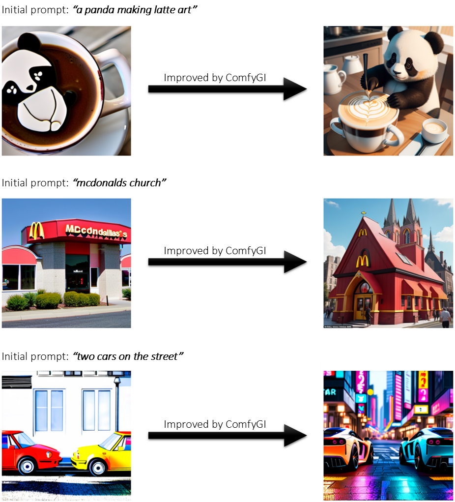

# ComfyGI - Image Generation Workflow Optimization Made Easy 

Tools like [ComfyUI](https://github.com/comfyanonymous/ComfyUI) make it easy to build even complex image generation workflows. However, often a lot of manual work and fine-tuning is needed to get high-quality results. With **ComfyGI**, manual adjustment is no longer required as workflows are automatically improved based on a genetic improvement approach to generate more aesthetically appealing images.

## Example Image Improvements

Here you see some example images generated with workflows optimized by ComfyGI:

## Code Availability 

The source code will be published here soon. If you have any questions, please do not hesitate to contact the authors.
